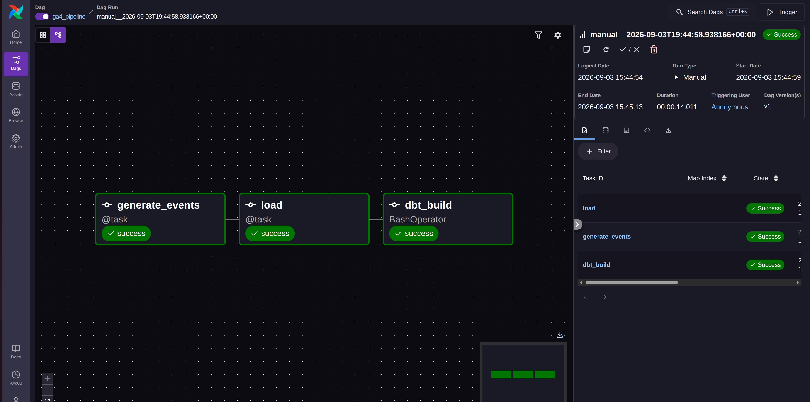

# Pipeline Walkthrough

A step-by-step walkthrough of the pipeline. Each section describes each functional area within the pipeline and provides instructions for local implementation, validation, and confirmation. Please see the [README](https://github.com/a-dymovsky/ga4-elt-pipeline/blob/main/README.md) for quickstart instructions.
    
## Step 1: Generate Events

`generate()` produces one day's worth of synthetic GA4-shaped web-analytics events. Each run is reproducible and seeded by the date. Each "user" is captured with one or more sessions, with each session serving as a weighted-but-random sequence of events. Each session is stamped with a traffic source and every event with an increasing timestamp. Each event is assembled into a flat record with additional details packaged into a JSON `event_params` field to mirror GA4's BigQuery export. The full day's data is collected into a Pandas dataframe and written as Parquet into a date-partitioned folder (`event_date=YYYY-MM-DD/`) that is overwritten. Each date run replaces its data.

### Proof

```bash
cd ~/ga4-elt-pipeline
source .venv/bin/activate
```

Generate a day's data:

```bash
python include/generator/generate_events.py --date 2024-06-01
```

```text
[generate]   5759 events -> include/landing/events/event_date=2024-06-01 
```

Inspect the data as a CSV dump:

```bash
python -c "import pandas as pd; pd.read_parquet('include/landing/events/event_date=2024-06-01/part-0.parquet').to_csv('sample_events.csv', index=False)"
```

Validate the seeding. Generate the same date twice and confirm each run is identical:

```bash
python include/generator/generate_events.py --date 2024-06-01
python -c "import pandas as pd; a = pd.read_parquet('include/landing/events/event_date=2024-06-01/part-0.parquet'); print('run 1 rows:', len(a)); import hashlib; print('run 1 hash:', hashlib.md5(a.to_csv(index=False).encode()).hexdigest())"

python include/generator/generate_events.py --date 2024-06-01
python -c "import pandas as pd; a = pd.read_parquet('include/landing/events/event_date=2024-06-01/part-0.parquet'); print('run 2 rows:', len(a)); import hashlib; print('run 2 hash:', hashlib.md5(a.to_csv(index=False).encode()).hexdigest())"
```

```text
[generate]   5759 events -> include/landing/events/event_date=2024-06-01 
run 1 rows: 5759  
run 1 hash: 32dd86bd1c73cedff5b0571bee0eb00c 
[generate]   5759 events -> include/landing/events/event_date=2024-06-01  
run 2 rows: 5759 
run 2 hash: 32dd86bd1c73cedff5b0571bee0eb00c 
```

Both runs produce the same hash. Event generation is provably deterministic. Any subsequent run, or potential backfill, produces identical data.

## Step 2: Extract and Load Events

`load_partition()` copies a single date's Parquet yield into DuckDB as a `raw.events` table. This represents the "extract" and "load" portions of this ELT project. Raw data is expressed in the JSON 'event_params' for dbt to handle downstream. The load is idempotent: any re-attempts or backfills never produce duplicates. Hive partitioning means 'event_date' is derived from the folder name rather than read from the file itself.

### Proof

```bash
just generate 2024-06-01
just load 2024-06-01
```

```text
[generate]   5759 events -> /home/personal/Documents/ga4-elt-pipeline/include/landing/events/event_date=2024-06-01
```

```text
[load]   5759 rows for 2024-06-01 -> raw.events in /home/personal/Documents/ga4-elt-pipeline/include/warehouse/wh.duckdb 
```

Confirm the events landed as rows in the database:

```bash
python -c "import duckdb; con = duckdb.connect('include/warehouse/wh.duckdb'); print(con.sql('select count(*) as total from raw.events'))"
```

```text
┌───────┐
│ total │
│ int64 │
├───────┤
│  5759 │
└───────┘
```

Confirm idempotent returns by loading the same data twice. Confirm that the count does not double.

```bash
just load 2024-06-01
python -c "import duckdb; con = duckdb.connect('include/warehouse/wh.duckdb'); print(con.sql('select count(*) as total_after_reload from raw.events'))"
```

```text
/home/personal/Documents/ga4-elt-pipeline/.venv/bin/python include/loader/load_to_duckdb.py --date 2024-06-01
[load]   5759 rows for 2024-06-01 -> raw.events in /home/personal/Documents/ga4-elt-pipeline/include/warehouse/wh.duckdb
┌────────────────────┐
│ total_after_reload │
│       int64        │
├────────────────────┤
│               5759 │
└────────────────────┘
```

Event count remains unchanged. The loader deletes extant rows prior to inserting.

## Step 3: Transform (dbt)

dbt reads `raw.events` and builds a modeled layer on top of it inside the same DuckDB file. `stg_events` is a view that parses the JSON `event_params` payload into typed columns and standardizes naming. Three materialized marts sit on top of it: `fct_events` (one row per event with surrogate keys), `fct_sessions` (one row per session for its events and attributes), and `dim_traffic_source` (distinct UTM combinations with a derived `channel_group`). dbt determines build order itself by reading the `ref()` links between models, and `dbt build` runs models and their tests together.

### Proof

Run the models.

```bash
just dbt
```

```text
02:58:54  17 of 17 START test unique_fct_events_event_key ................................ [RUN]
02:58:54  15 of 17 PASS not_null_fct_events_session_key .................................. [PASS in 0.13s]
02:58:54  16 of 17 PASS relationships_fct_events_traffic_source_key__traffic_source_key__ref_dim_traffic_source_  [PASS in 0.12s]
02:58:54  17 of 17 PASS unique_fct_events_event_key ...................................... [PASS in 0.06s]
02:58:54  
02:58:54  Finished running 3 table models, 13 data tests, 1 view model in 0 hours 0 minutes and 1.36 seconds (1.36s).
02:58:55  
02:58:55  Completed successfully
02:58:55  
02:58:55  Done. PASS=17 WARN=0 ERROR=0 SKIP=0 NO-OP=0 REUSED=0 TOTAL=17
```

Initial payload expresses raw events in standard, opaque JSON.

```bash
python -c "
import duckdb
con = duckdb.connect('include/warehouse/wh.db')
print(con.sql('select event_name, event_params from raw.events limit 3'))
"
```

```text
┌───────────────┬──────────────────────────────────────────────────────────────────────────────────────────────────────┐
│  event_name   │                                             event_params                                             │
│    varchar    │                                               varchar                                                │
├───────────────┼──────────────────────────────────────────────────────────────────────────────────────────────────────┤
│ session_start │ {"page_location": "https://shop.example.com/product/monitor-arm", "page_title": "product monitor-arm │
│               │ ", "ga_session_id": 1717200001, "session_engaged": 0}                                                │
├───────────────┼──────────────────────────────────────────────────────────────────────────────────────────────────────┤
│ page_view     │ {"page_location": "https://shop.example.com/cart", "page_title": "cart", "ga_session_id": 1717200001 │
│               │ , "session_engaged": 0}                                                                              │
├───────────────┼──────────────────────────────────────────────────────────────────────────────────────────────────────┤
│ session_start │ {"page_location": "https://shop.example.com/blog/wfh-setup", "page_title": "blog wfh-setup", "ga_ses │
│               │ sion_id": 1717200002, "session_engaged": 1}                                                          │
└───────────────┴──────────────────────────────────────────────────────────────────────────────────────────────────────┘
```

The same fields as typed columns in `stg_events`:

```bash
python -c "
import duckdb
con = duckdb.connect('include/warehouse/wh.duckdb')
print(con.sql('select event_name, page_title, event_value from main.stg_events limit 3'))
"
```

```text
┌───────────────┬─────────────────────┬─────────────┐
│  event_name   │     page_title      │ event_value │
│    varchar    │       varchar       │   double    │
├───────────────┼─────────────────────┼─────────────┤
│ session_start │ product monitor-arm │        NULL │
│ page_view     │ cart                │        NULL │
│ session_start │ blog wfh-setup      │        NULL │
└───────────────┴─────────────────────┴─────────────┘
```

The JSON payload now appears in the form of legible, discernable columns.

```bash
python -c "
import duckdb
con = duckdb.connect('include/warehouse/wh.duckdb')
print(con.sql('select session_key, source, medium, event_count, is_engaged, revenue from main.fct_sessions limit 5'))
"
```

```text
┌──────────────────────────────────┬────────────┬─────────┬─────────────┬────────────┬─────────┐
│           session_key            │   source   │ medium  │ event_count │ is_engaged │ revenue │
│             varchar              │  varchar   │ varchar │    int64    │   int64    │ double  │
├──────────────────────────────────┼────────────┼─────────┼─────────────┼────────────┼─────────┤
│ a2f2795bc13e55652e76a2f64277bed3 │ newsletter │ email   │           4 │          1 │     0.0 │
│ 00fb2e68cfcc1d0e3296a0b5872e7a22 │ google     │ organic │           9 │          1 │     0.0 │
│ 4219c1d20753e1662b1491167131ecfd │ (direct)   │ (none)  │           3 │          1 │     0.0 │
│ e19082699dbc1af6eb7491e9762cab55 │ newsletter │ email   │           6 │          1 │     0.0 │
│ 808511aee457037a76f0ac410ef48756 │ (direct)   │ (none)  │           6 │          1 │     0.0 │
└──────────────────────────────────┴────────────┴─────────┴─────────────┴────────────┴─────────┘
```

Each row is one session rather than one event. `event_count` shows how many events were collapsed into it. Each carries the traffic source that opened the session. Most sessions show zero revenue. Only converting sessions carry a value.

## Step 4: Orchestrate (Airflow)

`dags/ga4_pipeline.py` runs the same three stages on a schedule: `generate_events → load → dbt_build`. The two Python tasks import the same modules the justfile calls, therefore the local run and the orchestrated run share one codebase. Airflow adds scheduling, retries, and a UI. Each run operates on its logical date. The idempotency of the generator and loader enable backfills and reattempts at any time. Airflow runs locally in Docker via the Astro CLI: the `ENV` lines in the `Dockerfile` point the tasks at the same DuckDB file inside the container.

Initialize Airflow:

```bash
astro dev start
```

Navigate to your Airflow instance, specify the `ga4_pipeline` DAG, and trigger a run.



